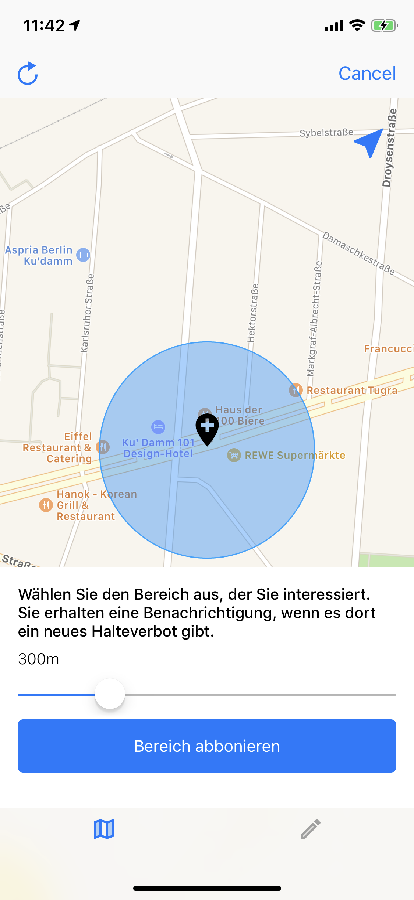
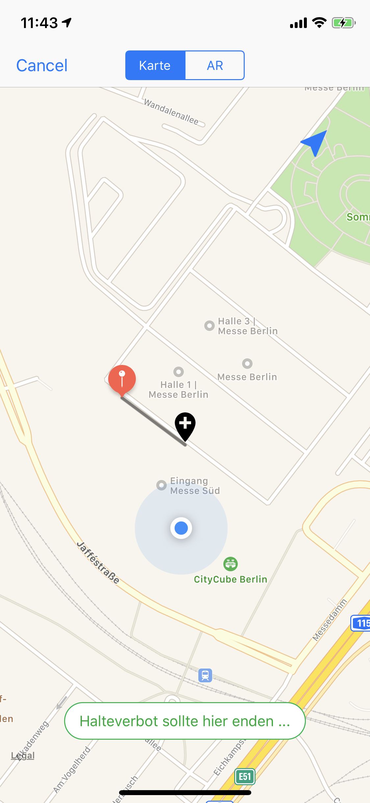
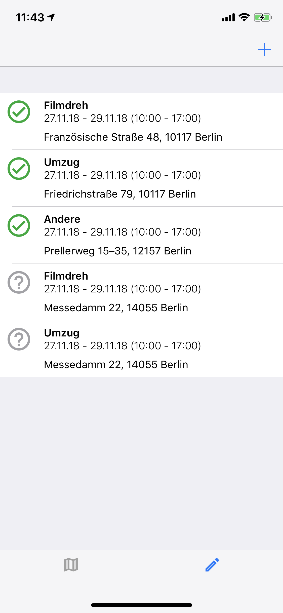

# tzp-iOS

This handy litte iOS App was introduced by Konstantin and Tobias at a Hackathon on the Smartcountry Hackathon.
It is Part of a eco-system that represents a way to apply for a temporary no-parking zone.
Additionally the User can subscribe to a certain Area to get Notifications about new no-parking zones.

### Screenshots

<p align="center">




</p>

### AR Video

<p align="center">

</p>

## App Requirements

This iOS App is written with `swift 4.2` in `Xcode 10.1`.
For some Dependencies it uses `Cocoapods v1.5.3` (more info)[cocoapods.org]

## Pre Install

```BASH
$ pod install
```

Please let the App run on a real Device, for the AR Part it requires to have a Camera.


## External dependencies / libraries

See [`Podfile`](Podfile)

- `R.swift` for generated Constants and assets
- `RxSwift` - Reactive Programming for swift
- `RxCocoa` - Reactive Programming for Cocoa
